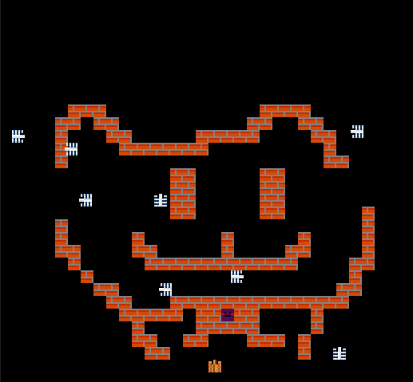

# (TODO: your game's title)

Author: Fengying Yang

Design: Control your tank and destroy all enemies.

Screen Shot:

How Your Asset Pipeline Works:

I created two kind of files for loading tiles(sprite) and level starting layout seperately. For each sprite file, the first four lines are the pallete setting for this tile. And the next 8 lines are bits[0-3] to encode the image. In the loading functions, I read the palettes and bit image from the files and cache them in global variable. For each tile, I convert it into two bit map, and also rotate it to 4 directions to create extra tiles. In the level file, I encode the map starting layout as a 32 x 30 matrix, and use this information to initialize the sprites in the game.

How To Play:

Use the direction keys to control the yellow tank, press `space` to shoot the enermies and protect your basement (the purple face) from being destroyed. 

The AI of enemies and the collision handling need to be improved...

Sources: I drew the image by myself.

This game was built with [NEST](NEST.md).
